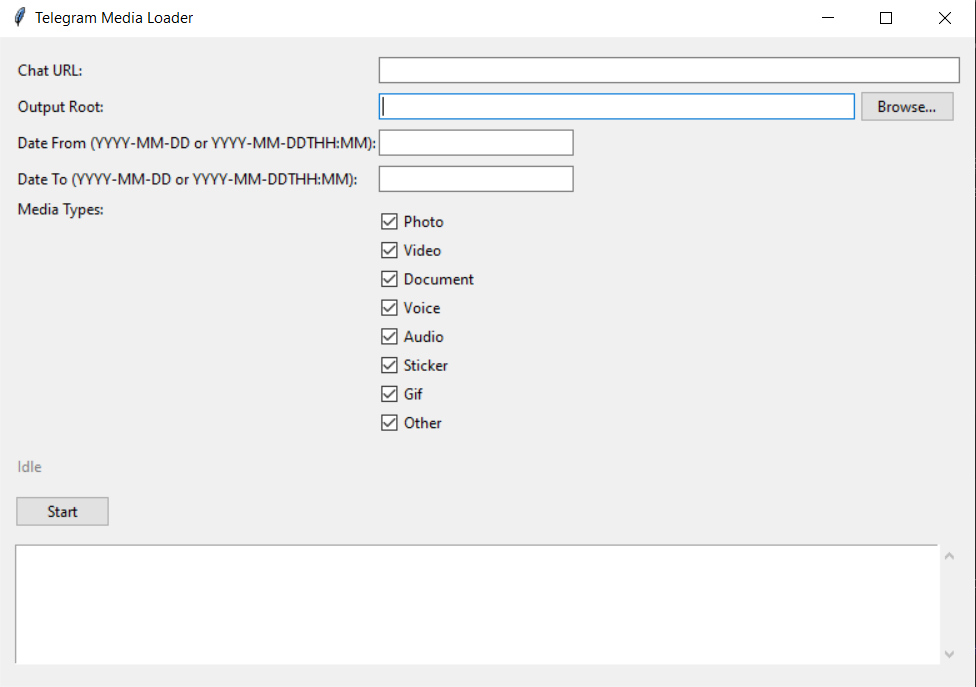

# Telegram Media Loader

Desktop + CLI tool that logs into Telegram via a **user session** and downloads media from:

- private chats  
- group chats / supergroups  
- channels (with or without topics)

Files are **deduplicated**, grouped into **topic / album / date** folders, and described in both a **metadata ndjson log** and a **SQLite ledger**, so you can safely re-run the loader without getting duplicates.

Originally built to feed a photo-report automation pipeline, but designed as a **general-purpose Telegram media archiver**.

---

## Highlights

- **Works with everything** – private chats, groups, supergroups, channels, forum topics.
- **Any media type** – photos, videos, documents, audio/voice, stickers, GIFs, “other” attachments.
- **No duplicates on rerun** – previously downloaded media are tracked in SQLite and skipped.
- **Album-aware** – media sent as a Telegram album are saved together in their own subfolder.
- **Date-based layout** – inside each topic, files are split by `YYYY-MM-DD` folders for quick navigation.
- **Full metadata trail** – every file gets a line in `metadata.ndjson` plus a row in a SQLite ledger.
- **Two entry points** – command-line interface and a Tkinter GUI built on top of the same backend.

---

## Stack

- Python 3.11+ (also runs on 3.10 once Telethon is installed)
- [Telethon](https://github.com/LonamiWebs/Telethon) for Telegram API access (user session)
- Tkinter (standard library) for the GUI
- `python-dotenv`, `PyYAML`, `tqdm`, `tzdata` for config, progress and timezone handling
- SQLite for the download ledger

---

## Installation

```bash
git clone https://github.com/AlenaYashkina/tg_media_loader.git
cd tg_media_loader

python -m venv .venv
# Windows
.\.venv\Scripts
ctivate
# Linux/macOS
# source .venv/bin/activate

pip install -e .
```

Copy the example config files and adjust them:

```bash
cp .env.example .env
cp config.example.yaml config.yaml
```

Fill in in `.env`:

```env
TG_API_ID=...
TG_API_HASH=...
TG_PHONE_NUMBER=...
TG_SESSION_NAME=telegram_media_loader
```

And in `config.yaml` set defaults like:

```yaml
output_root: downloads
default_media_types:
  - photo
  - video
  - document
  - voice
  - audio
  - sticker
  - gif
log_level: INFO
sqlite_path: data/state.sqlite
tz: UTC
```

---

## CLI usage

Basic example:

```bash
python -m telegram_media_loader   --chat-url https://t.me/some_channel   --output-root "D:/tg_downloads"   --date-from 2024-01-01   --date-to 2024-03-31   --media-types photo,video,document   --config config.yaml   --log-level INFO
```

### Main options

- `--chat-url` – required. Supports:
  - `https://t.me/<username>`
  - `https://t.me/c/<internal_id>` (private/supergroups)
  - `me` / `self` for your personal “Saved Messages”
- `--output-root` – base folder for downloads (overrides `output_root` in config).
- `--date-from`, `--date-to` – inclusive UTC datetimes (`YYYY-MM-DD` or `YYYY-MM-DDTHH:MM`).  
  If omitted, the full history is scanned.
- `--media-types` – comma-separated list:
  `photo, video, document, voice, audio, sticker, gif, other`.
- `--config` – path to YAML/JSON config (defaults to `config.yaml`).
- `--log-level` – `INFO` (default), `DEBUG`, or `ERROR`.

Environment variables from `.env` are used as defaults; CLI flags override config, config overrides `.env`.

---

## Folder structure & metadata

For each chat, the loader builds a tree like:

```text
<output_root>/
  <chat_slug>/
    metadata.ndjson
    <topic_slug_or___root>/
      YYYY-MM-DD/
        <album_or_single>/
          <message_id>_<media_index>_<media_type>.<ext>
```

- **Chat slug** – derived from username or internal id.  
- **Topic folder** – forum topic title, or `topic-<id>`; for non-topic chats, `__root`.
- **Date folder** – message date in `YYYY-MM-DD`.
- **Album folder** – when Telegram sends an album (`grouped_id`), all files land in a shared subfolder.
- **File name** – includes `message_id`, index inside the message, and media type.

### Metadata log

Each downloaded message appends a JSON line to:

```text
<output_root>/<chat_slug>/metadata.ndjson
```

Typical fields:

- `chat_id`, `chat_username`, `chat_title`, `chat_type`
- `message_id`, `grouped_id`, `topic_id`, `topic_title`, `date_iso`
- `sender_id`, `sender_username`, `sender_display_name`
- `text_raw`, `reply_to_message_id`
- `media_type`, `file_path`, `file_size`, `mime_type`
- `has_spoiler`, `is_forwarded`, `forward_from_id`, `forward_from_username`, `extra`

This is handy for later analysis or building your own reports/dashboards.

### SQLite ledger

`data/state.sqlite` keeps a `downloaded_media` table with fields like:

- `chat_id`, `message_id`, `media_index`, `media_type`
- `file_path`, `file_size`, `mime_type`
- `date_iso`, `downloaded_at`, `status`

A unique constraint on `(chat_id, message_id, media_index)` ensures that repeated runs skip media that was already downloaded.

### Logging

Structured logs are written to `logs/app.log`, for example:

```text
[2024-01-01 12:00:00] INFO telegram_media_loader.downloader - Saved photo ... 
```

Console output mirrors `INFO`/`ERROR` messages.

---

## GUI

Run the desktop GUI with:

```bash
python -m telegram_media_loader.gui
# or
python gui.py
```

Features:

- Auth flow with phone, SMS code and 2FA support.
- Fields for chat URL, output root, media types and date filters.
- Start/Stop controls and a live log pane.
- Same backend as the CLI, so behaviour and folder layout stay consistent.

### GUI preview



---

## Typical use cases

- Back up media from important channels or private chats.
- Pull training datasets (photos, documents, etc.) from Telegram.
- Feed downstream automation (e.g. photo-report generators) with a clean, deduplicated media archive.

---

## About the author

Built by **Alena Yashkina** — lighting engineer turned AI‑automation developer.  
Portfolio and contact links:

- GitHub: https://github.com/AlenaYashkina
- LinkedIn: https://www.linkedin.com/in/alena-yashkina-a9994a35a/
